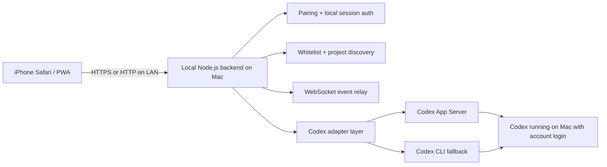

# Codex Mobile

Control Codex on your Mac from your phone over your local network, with a local-first mobile web app and no API key flow in the browser.

Codex Mobile keeps the Mac as the trusted machine:

- Codex stays logged in on the Mac with your existing ChatGPT or Codex account session
- the phone never handles Codex auth tokens directly
- the browser only gets a local paired-device session for this app

This project prefers `codex app-server` for the full experience and falls back to the Codex CLI when needed.

## Why this exists

Sometimes you want to kick off, monitor, or approve Codex work without sitting at your desk. Codex Mobile gives you a practical phone-first control surface:

- browse a whitelist of project folders on your Mac
- start or resume sessions
- send prompts
- watch streaming output
- approve file edits and commands
- check recent history

All without shipping your workflow to a cloud relay or pasting an API key into your phone.

## Current status

What works today:

- local backend on macOS
- mobile-first React PWA that installs to iPhone home screen
- one-time pairing code shown only on the Mac console
- project whitelist enforcement
- session listing, creation, resume, messaging, interrupt
- WebSocket event relay for streaming output
- approval handling through Codex App Server
- session history view
- local persistence for paired devices and recent sessions
- tests for path validation, pairing, and API behavior

Current limitation:

- the CLI fallback is intentionally degraded compared with App Server
- it can stream one-shot turns and check login status, but it does not provide the full interactive approval and history experience

## Built on current Codex docs

This repo is designed around current official Codex documentation:

- [Codex CLI](https://developers.openai.com/codex/cli)
- [Codex App Server](https://developers.openai.com/codex/app-server)

The implementation assumes:

- Codex CLI supports account login on the Mac
- App Server is the preferred integration path for auth state, approvals, thread lifecycle, and streaming events

## Quick start

### Requirements

- macOS
- Node.js 22+
- Codex CLI installed
- Codex already logged in on the Mac

### 1. Clone and install

```bash
git clone https://github.com/asarshad/codex-mobile.git
cd codex-mobile
nvm use
npm install
```

### 2. Create a local config

```bash
npm run setup:config
```

This creates `codex-mobile.config.json` in the repo root.

### 3. Check the environment

```bash
npm run doctor
```

### 4. Enable LAN access if you want phone access

Edit `codex-mobile.config.json`:

```json
{
  "server": {
    "host": "0.0.0.0",
    "allowLan": true
  }
}
```

Also set your allowed project roots:

```json
{
  "projects": {
    "allowedRoots": ["/Users/you/dev/projects"]
  }
}
```

### 5. Build and start

```bash
npm run build
npm run start
```

### 6. Open it on your phone

Visit your Mac's LAN address, for example:

```text
http://192.168.1.20:4318
```

Press `Generate One-Time Code` in the phone UI. The code appears only in the Mac terminal running Codex Mobile.

## Developer workflow

Run the backend and frontend in development mode:

```bash
npm run dev
```

Useful commands:

```bash
npm run setup:config
npm run doctor
npm test
npm run build
npm run start
```

## Configuration

Start from [config/codex-mobile.config.example.json](./config/codex-mobile.config.example.json).

Important settings:

- `server.host`
  - use `127.0.0.1` for Mac-only access
  - use `0.0.0.0` for phone access over LAN
- `server.allowLan`
  - `false` keeps the server loopback-only
  - `true` allows private-LAN traffic
- `projects.allowedRoots`
  - only folders under these roots are visible or openable
- `projects.scanDepth`
  - controls project discovery depth
- `codex.preferredAdapter`
  - `app-server` or `cli`
- `codex.binaryPath`
  - use an absolute path if needed

## Security model

Codex Mobile is intentionally conservative:

- Codex auth stays on the Mac
- the phone browser never gets Codex auth tokens
- pairing requires a one-time code shown on the Mac
- browser auth uses an HTTP-only cookie plus CSRF token
- only whitelisted folders may be used
- manual project paths are normalized and validated with realpath checks
- requests are limited to loopback by default, or private-LAN traffic when explicitly enabled
- secrets should never be logged

This is still a LAN app, so you should only use it on networks you trust.

## Architecture



Main pieces:

- `packages/server`
  - Express API
  - WebSocket relay
  - pairing and local auth
  - folder whitelist enforcement
  - App Server and CLI adapters
- `packages/web`
  - React + Vite PWA
  - pairing UI
  - project list
  - session screen
  - approval actions

## API

- `GET /api/health`
- `GET /api/auth/status`
- `POST /api/pair/start`
- `POST /api/pair/verify`
- `GET /api/projects`
- `POST /api/sessions`
- `GET /api/sessions`
- `GET /api/sessions/:id`
- `POST /api/sessions/:id/message`
- `POST /api/sessions/:id/approve`
- `POST /api/sessions/:id/reject`
- `POST /api/sessions/:id/interrupt`
- `WS /api/events`

## Testing

Run:

```bash
npm test
```

Covered today:

- allowed-root path validation
- pairing/session creation
- basic API access rules

## Packaging and distribution

This repo is ready for public use from source right now.

Planned next steps:

- publish a packaged CLI installer to npm
- create a Homebrew tap for one-command install on macOS
- add release artifacts so users can install without cloning the repo

The current codebase is structured to make that possible, but this repo is not yet published to npm or Homebrew.

## Troubleshooting

### Codex is not logged in

Run:

```bash
codex login
```

Then verify:

```bash
codex login status
```

### App Server is unavailable

Check:

```bash
codex app-server --help
```

Codex Mobile will fall back to CLI mode, but the experience will be more limited.

### Phone cannot reach the server

Check:

- your Mac and phone are on the same private network
- `server.host` is `0.0.0.0`
- `server.allowLan` is `true`
- the macOS firewall allows the Node process
- you are using the Mac's current LAN IP

## License

[MIT](./LICENSE)

## Disclaimer

This is an independent open source project built around Codex tooling. It is not an official OpenAI product.
